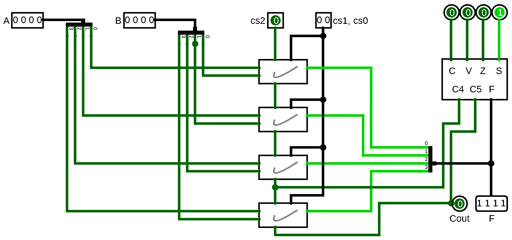
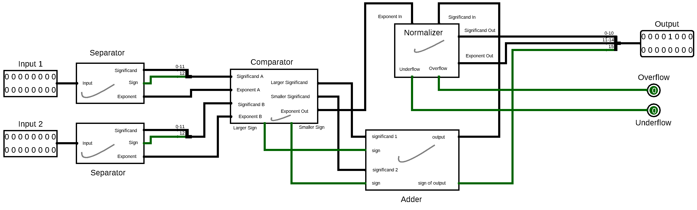
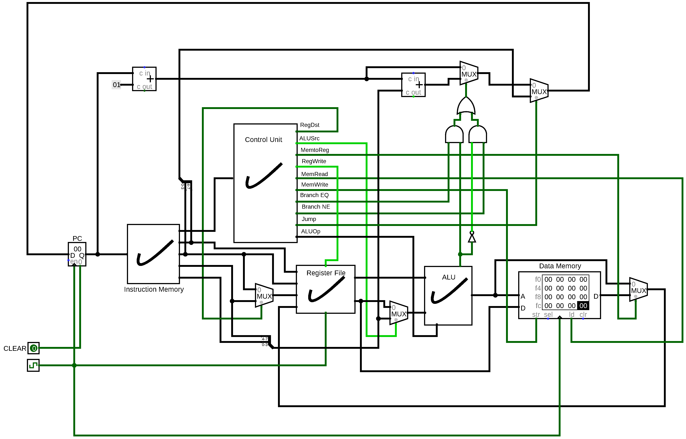
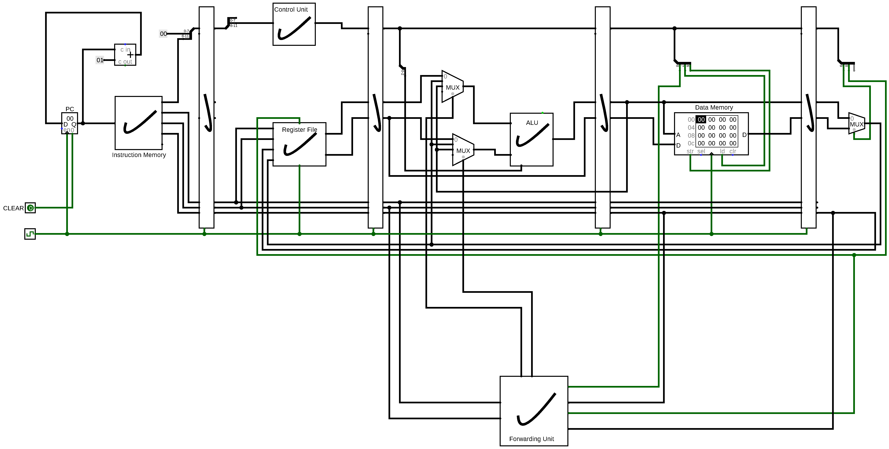

## Offline 1: 4-bit ALU simulator

**Instructions**: [[PDF]](/1-4-bit-alu-simulator/instructions.pdf)

**Report**: [[PDF]](/1-4-bit-alu-simulator/report.pdf)

## Offline 2: Floating-point adder

**Instructions**: [[PDF]](/2-floating-point-adder/instructions.pdf)

**Report**: [[PDF]](/2-floating-point-adder/report.pdf)

## Offline 3: 8-bit MIPS datapath

**Instructions**: [[PDF]](/3-mips-instruction-set/instructions.pdf)

**Report**: [[PDF]](/3-mips-instruction-set/report.pdf)

## Offline 4: 8-bit MIPS pipelining

**Instructions**: [[PDF]](/4-mips-pipelining/instructions.pdf)

**Report**: [[PDF]](/4-mips-pipelining/report.pdf)

## Group Members

- Ayan Antik Khan (1705036)
- Mushtari Sadia (1705037)
- Fardin Hossain (1705038)
- Tahmeed Tarek (1705039)
- Najibul Haque Sarker (1705044)
